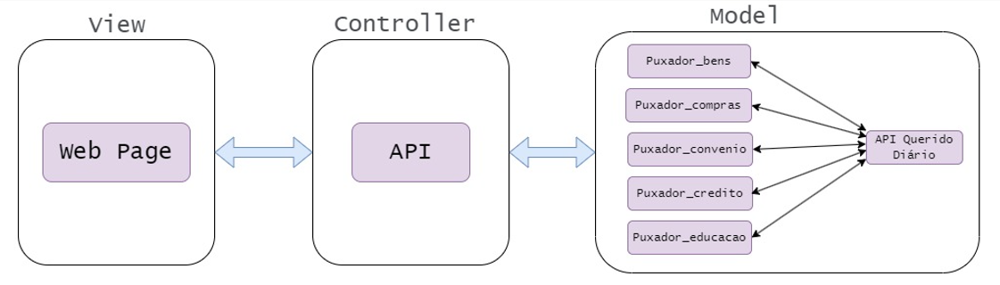

# Arquitetura

## Visão Geral da arquitetura

Neste sistema, foram usados dois ambientes: o ambiente do `front-end`, que é onde foi construída a parte visual do projeto, sendo representado pela pasta `web`, que armazena a web page do projeto, e o ambiente `Bases web`, com a pasta de mesmo nome que está dentro do ambiente do `front-end` e representa o ambiente de lógica do nosso projeto, obtendo todos os dados que serão usados.

A imagem abaixo ilustra a disposição dos elementos do projeto. 

## Funcionamento

Os códigos de raspagem de dados presentes em `Bases web` extraem as informações necessárias, tratam-nas e as salvam em vários arquivos JSON. Esses arquivos são utilizados pela web page para exibir as informações de forma gráfica. O algoritmo de licitações usa a API `dados abertos` do governo para obter os dados usados, enquanto os demais algoritmos utilizam a API do `querido diário`. A web page usa `JavaScript`, `HTML` e `CSS` em sua construção, e `Bases web` usa `Python`.
