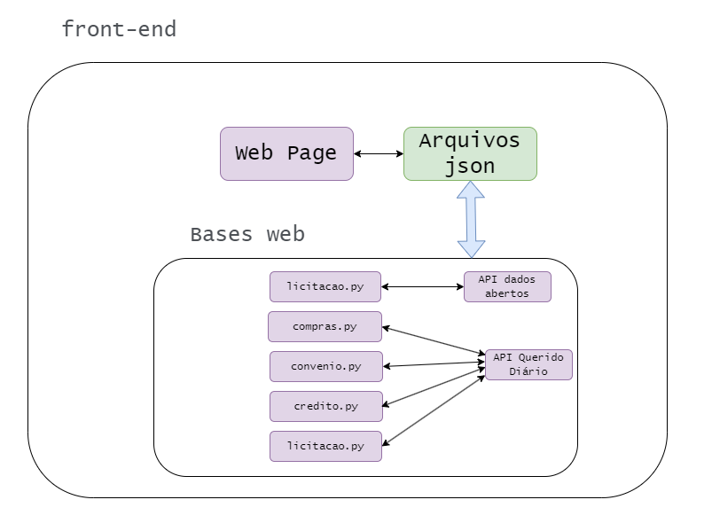

# Arquitetura

## Visão Geral da arquitetura

Para esse sistema foi escolhido o modelo de arquitetura MVC pois apresenta facilidades quanto ao desenvolvimento por ser um modelo onde divide a aplicação em três componentes principais: Model (Modelo), View (Visão) e Controller (Controlador). Cada componente tem uma responsabilidade específica, o que ajuda a modularizar e organizar o código, facilitando o desenvolvimento e a manutenção dos códigos. 

A imagem abaixo ilustra a disposição dos elementos do projeto distribuídos no modelo de arquitetura selecionado. 

## Model (Modelo)

### Responsabilidade:

O Modelo representa a camada de dados da aplicação. Ele lida com a lógica de negócios, armazenamento e recuperação de informações. As principais responsabilidades do Modelo incluem: Gerenciamento de dados e estado da aplicação. Realização de cálculos e operações de lógica de negócios. Notificação de alterações aos observadores interessados.

Neste projeto, essa camada contém alguns algoritmos de busca com funções que acessam a API do querido diário, que retorna os dados brutos, os quais são tratados e organizados pelos algoritmos, retornando uma lista de dicionários com as informações obtidas para a camada Controller.

## View (Visão)

### Responsabilidade:

A Visão é responsável pela apresentação e captação dos dados do usuário. Ela exibe a interface gráfica e permite a interação do usuário com a aplicação.

O nosso projeto possui apenas uma interface gráfica com a finalidade de receber os dados fornecidos pelo usuário e retornar informações gráficas fáceis de serem visualizadas.

## Controller (Controlador)

### Responsabilidade:

O Controlador atua como intermediário entre o Modelo e a Visão. Ele recebe as entradas do usuário (como inputs e comandos), processa essas entradas (às vezes alterando o Modelo), e atualiza a Visão conforme necessário.

O projeto possui apenas uma API na camada de controle, e essa API atua como uma ponte entre a visão e o modelo, realizando algumas verificações para garantir que os dados sejam recebidos e retornados de maneira correta.